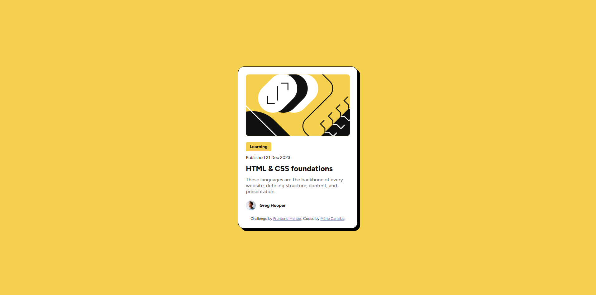

# Frontend Mentor - Solução de cartão de pré-visualização de blog

Esta é uma solução para o [desafio de cartão de pré-visualização de blog no Frontend Mentor](https://www.frontendmentor.io/challenges/blog-preview-card-ckPaj01IcS). Os desafios do Frontend Mentor ajudam você a melhorar suas habilidades de codificação construindo projetos realistas.

## Índice

- [O desafio](#o-desafio)
- [Captura de tela](#captura-de-tela)
- [Links](#links)
- [Meu processo](#meu-processo)
- [Criado com](#construído-com)
- [O que aprendi](#o-que-aprendi)

### O desafio

Os usuários devem ser capazes de:

- Ver os estados de foco e foco para todos os elementos interativos na página

### Captura de tela

### Links

- URL da solução: [https://github.com/MarioCarlaibe/blog-preview-card-main]
- URL do site ativo: [https://mariocarlaibe.github.io/blog-preview-card-main/]

## Meu processo

Iniciei bem o html, mas tive que pesquisar mais algumas técnicas ao abordar o projeto. Usei variaveis para as cores, um box-shadow e um hover para um link especifico. Esses desafios me ajudaram a crescer mentalmente.

### Criado com

- Marcação HTML5 semântica
- Propriedades personalizadas CSS
- Flexbox
- Fluxo de trabalho mobile-first
- Figma

### O que aprendi

Aprendi a importancia de continuar a pesquisar e preticar. Durante o processo me deparei com assuntos que já havia aprendido mas esquecido. Ao pesquisar novamente, me lembrei rapidamente. Segue alguns trechos a relembrar.

  box-shadow: 8px 8px #000000;
  border: 1px solid #000000;

o box-shadow não havia usado ainda, mas no site da MDN e na W3school foi facil achar essa matéria.

.container .descrition .tags .link:hover{
    color: var(--Yellow);
}

nesse caso relembrei a importancia de usar variaveis e o hover, para estilizar alguns links.

e com respeito a ser responsivo, estava tendo dificuldades com a tags que não respondiam, e aprendi mais a respeito de especificidade, e dai o porque de não conseguir estilizar determinados elementos.